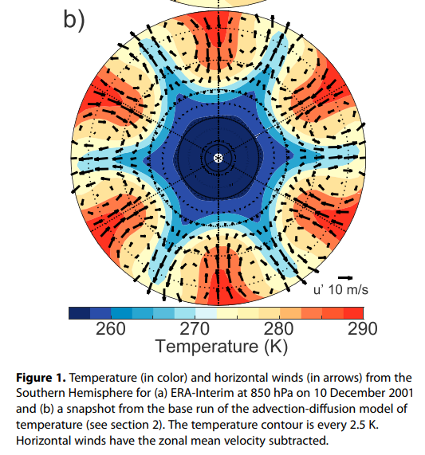
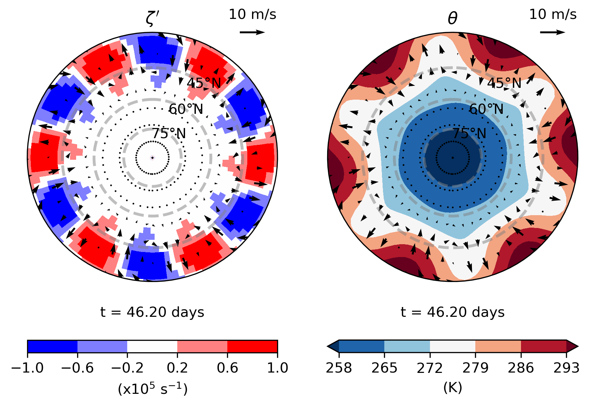

# bm3_forced_barotropic README

## 1. Introduction
The purpose of this project is to create an atmosphere toy model to solve the forced barotropic vorticity equations and apply this model within the context of ensemble forecasts. It has several different settings which can be modified, such as using linear or nonlinear dynamics, different forcing scenarios, the number of ensemble members and how the initial conditions are perturbed. One of the mains goals of this project is to explore how different forcing scenarios or ensemble initialisations can lead to bimodality in ensemble forecasts.

## 2. Model Dynamics
To spatially solve for vorticity, we're using spherical harmonics through the **spharm** Python package. One disadvantage of spectral methods is the presence of Gibbs osciallations, which are apparent in the case of rapidly changing vorticity fields. The integration scheme is RK4.

The linearized, forced barotropic vorticity equation we are solving for can be written as follows:
$$\frac{\partial\zeta '}{\partial t}= - \bar{u}\frac{\partial\zeta '}{\partial x} - v'\gamma - r_s\zeta' + F $$
(derivation below)

In the case of eddy stirring, similar to Vallis et al. (2003) we will represent red eddy forcing with an Ornstein‐Uhlenbeck stochastic process which takes the form

$$ F_{mn}^{t} = Q^{t} ( 1 - e^{-2dt/\tau} )^{1/2} + e^{-dt/\tau}F_{mn}^{t-1} $$

Where $n$ represents the total spectral wavenumber and $m$ the zonal spectral wavenumber. $\tilde{Q}^t$ is a complex number of the form $\tilde{Q}^t = a^t+ b^t i$ where $a$ and $b$ are drawn from $\mathcal{N}(\mu=0,\sigma=A)$, $A$ representing the stirring amplitude. $\tau$ is the decorrelation time of the stirring. Only total wavenumbers $8\le n \le 12$ are stirred. 

A latitude mask of  $\exp{ \left[ - \left( \frac{( |\phi| - \phi_o)}{\Delta\phi} \right)^2 \right]}$ is applied to represent stirring originating from the midlatitudes ($\Delta\phi=10^\circ$ and $\phi_o=40^\circ$).

A decorrelation timescale for stirring of $\tau=7$ days is used with a frictional timescale of $1/r_s = 7$ days. This is a good representation for baroclinic eddies.

#### 2.1 Advection-Diffusion Model
The advection diffusion model used is as follows:

$$\frac{\partial\theta}{\partial t} = -\mathbf{v}\cdot\nabla\theta - \frac{\theta - \theta_{eq}}{\tau_t} - \kappa\nabla^8\theta$$

where $\mathbf{v}$ is determined by the solved vorticity equation, $\kappa$ is the hyper-diffusion coefficient (0.1 day damping) and $\tau_t$ is the thermal relaxation timescale (8 days). 

The equilibrium temperature is set to be:
$\theta_{eq} = \theta_0 - \Delta\theta\sin^2\phi$

With $\theta_0 = 300$ K and $\Delta\theta=45$ K. 

#### 2.2 Example Run

  

  <em>An example 4-week integration of the model. Winds stir the temperature field. The left panel depicts winds relative to the zonal mean and the right panel are the total winds. The complex forcing term ensures that individual wave numbers are phase shifted relative to one another, removing zonally-dependent mixing over time.</em>

##### 2.2.3 Development of Climatology

We can run a single integration for a very long time to develop an idea of the climatological spread that develops as a function of latitude due to $F$. Since we rotate the waves, this should be zonally symmetric. This allows to develop a formal definition of climatology in our model.

#### Ensemble Run

In the context of ensemble forecasts, we can run multiples of these models in unison, with perturbations applied to the IC or forcing. Ultimately, we would like to see spread develop from the start of the forecast and then saturate, representing an approach to climatology. We may use our formal definition of climatology (see section 2.2.3) to check this.

For this model, ensemble members share a common forcing $F$ at the time of initialization (i.e., $F^{t=0}$ is identical among ensemble members) but $F$ then develops independently over time for each member. This represents the predictable forcing eventually breaking down with the existence of unpredictable forcings (baroclinicity). The timescale of this process is proportional to the decorrelation timescale of $F$.

  

  <em>
  A 10-member ensemble run, integrated from t=(0,T), where no IC perturbations are applied, but ensemble forcings decorrelate over time. The point in the domain with the largest variance at time = T is chosen and ensemble members are tracked to their origin location (as seen at t=0). Lines change color based on the temperature value of the ensemble member at time = t. Dashed contours depict the equilibrium temperature structure.
  </em>

<!-- 

  

  <em>
  A 200-member ensemble run, where no IC perturbations are applied, but ensemble forcings decorrelate over time. A randomly selected point is used to show how ensemble spread develops over time (second row). The spread over all longitudes at that latitude is also shown (third row). Dashed lines indicate when the ensemble has formally approached the climatological spread. 
  </em>

 -->

## 3. Code Documentation

**Bugs and unwanted features:** 
**Things to check:** Advection from anamolous meridional wind of mean temperature gradient $v'\frac{\partial \bar\theta}{\partial y}$: $\frac{\partial \bar\theta}{\partial y} = \frac{\partial \theta_{eq}}{\partial y}$?
 
Hyperdiffusion term only applied to smallest harmonic?  
Spatial covariance in ensemble perturbations of IC?

## 4. Future Improvements
Implement some sort of boundary layer paramterization  
Step function to represent sea ice field?

## 5. Derivations

#### Deriving Vorticity Equation

Beginning with an unforced system, we can write the evolution of absolute vorticity as:

$$\frac{D(F+\zeta)}{Dt} = 0 $$

which expands to

$$\frac{\partial\zeta}{\partial t} + u\frac{\partial\zeta}{\partial x} + \cancel{ u\frac{\partial f}{\partial x} } + v \frac{\partial\zeta}{\partial y} + v\frac{\partial f}{\partial y}=0$$

where the second term cancels since the zonal gradient of $f$ is zero.  
Defining $\beta= \frac{\partial f}{\partial y}$ and linearizing about zonal mean flow results in

$$\frac{\partial\zeta '}{\partial t} + \bar{u}\frac{\partial\zeta '}{\partial x} + v' (\frac{\partial \bar\zeta}{\partial y} + \beta)=0$$
which, since, 
$$\bar\zeta = \cancel{ \frac{\partial \bar v}{\partial x}} - \frac{\partial \bar u}{\partial y}$$
(zonal gradient of zonal average is zero) 
can expanded and simplified as follows:
$$\frac{\partial\zeta '}{\partial t} + \bar{u}\frac{\partial\zeta '}{\partial x} + v'(\beta -\frac{\partial^2 \bar u}{\partial y^2}) = 0 $$
$$\frac{\partial\zeta '}{\partial t} + \bar{u}\frac{\partial\zeta '}{\partial x} + v'\gamma = 0 $$
with $\gamma = (\beta -\frac{\partial^2 \bar u}{\partial y^2})$, the meriodinal gradient in absolute vorticity  

This is the basis of the equation we are trying to solve. Rather than freely evolving, we now also add a forcing term $F_\zeta$ (orography, Rossby waves, etc. ) as well as a dissipation term $r_s\zeta'$, where $r_s$ represents the frictional dissipation rate. Rearranging to solve for the vorticity tendency gives:
$$\frac{\partial\zeta '}{\partial t}= - \bar{u}\frac{\partial\zeta '}{\partial x} - v'\gamma + F_\zeta - r_s\zeta' $$

<!-- #### Reproducing L18 climatology -->
<!--  -->

<!--  -->

## 6. References

Vallis, Geoffrey K., et al. "A mechanism and simple dynamical model of the North Atlantic Oscillation and annular modes." Journal of the atmospheric sciences 61.3 (2004): 264-280.

Linz, Marianna, Gang Chen, and Zeyuan Hu. "Large‐scale atmospheric control on non‐Gaussian tails of midlatitude temperature distributions." Geophysical Research Letters 45.17 (2018): 9141-9149.

Barnes, Elizabeth A., et al. "Effect of latitude on the persistence of eddy‐driven jets." Geophysical research letters 37.11 (2010).

Held, Isaac M., et al. “Northern Winter Stationary Waves: Theory and Modeling.” Journal of Climate, vol. 15, no. 16, 2002, pp. 2125–2144. JSTOR, www.jstor.org/stable/26249392.

